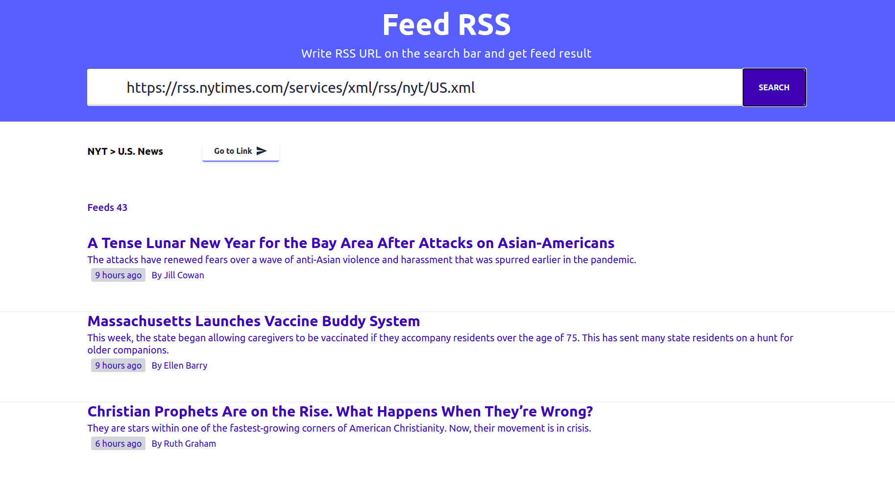

# Simple RSS Feed Project

This is a simple project for a challenge on [DevProjects by codementor](https://www.codementor.io/projects)

The purpose of the project is to show parsed links with additional content of a RSS feed URL.

Here is screen shot of parse and reading of RSS URL

## Created with

- `React.js`
- `tailwind.css`
